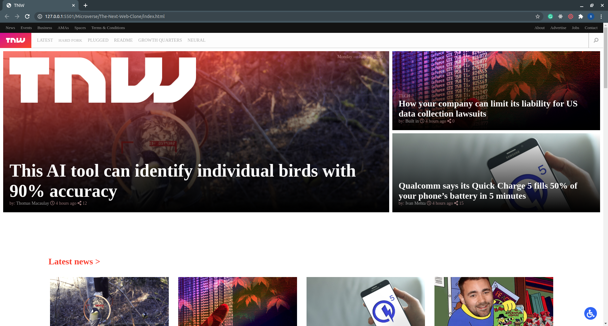

# The Next Web clone

> In this projecet we practice on responsive design
> by cloning this web-page.

## Built With

- HTML & CSS3,
- FlexBox, CSS-Grid, Float
- Media Querys

## Live Demo

[Live Demo Link](https://raw.githack.com/Miguelus373/The-Next-Web-Clone/Responsive-Design/index.html)

## Getting Started

To get a local copy up and running follow these simple example steps.

### Prerequisites

- Code Editor
- Web Browser

### Setup

$git clone https://github.com/sanadwj/Smashing-Magazine-Heat-map.git`

### Install

- Run a local server

### Usage

- Personal Project - The New York Times Clone

## Authors

👤 **Sanad Walid Abujbara**

- Github: [@sanadwj](https://github.com/githubhandle)
- Twitter: [@sandooog](https://twitter.com/sandooog)
- Linkedin: [Sanad-Abujbara](https://linkedin.com/in/sanad-abujbara)

👤 **Miguel Uzcátegui**

- Github: [@Miguelus373](https://github.com/Miguelus373 )
- Linkedin: [Miguel-Uzcátegui](https://www.linkedin.com/in/miguelus/)

## 🤝 Contributing

Contributions, issues and feature requests are welcome!

Feel free to check the [issues page](issues/).

## Show your support

Give a ⭐️ if you like this project!

## Acknowledgments

- Hat tip to anyone whose code was used

## 📝 License

This project is [MIT](lic.url) licensed.
